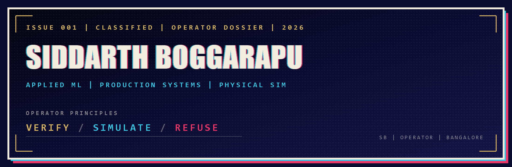

  

# Siddarth Boggarapu

Bangalore · [Portfolio](https://siddarthb07.github.io/siddarthb/) · [Email](mailto:siddarthb078@gmail.com) · [LinkedIn](https://www.linkedin.com/in/siddarth-boggarapu-12411339b/)

I build systems that operate under uncertainty across finance, healthcare, security, and physical simulation — measurable, explainable, and grounded in real-world constraints.

**Verify · Simulate · Refuse** — look inside systems, stress them before reality costs, and treat calibrated refusal as a feature.

## Projects

| | |
| --- | --- |
| **[Anima](https://github.com/Siddarthb07/Anima)** | LLM valence / arousal / uncertainty probes on Hugging Face models + guard. [Demo](https://huggingface.co/spaces/sidb078/Anima) |
| **[Corvex](https://github.com/Siddarthb07/corvex)** | Multi-host campaign correlator. Strong on sealed synthetic ATT&CK packs; not yet validated on real enterprise telemetry. Containment gated / dry-run. |
| **[GeoQuant](https://github.com/Siddarthb07/GeoQuant)** | Quant trading stack — ML signals, sentiment, walk-forward backtests, Alpaca paper routing |
| **[Drift](https://github.com/Siddarthb07/Drift)** | Health risk platform using ACC/AHA + FINDRISC clinical models, biomarkers, wearables |
| **[Drone vortex → NeuralVortex](https://github.com/Siddarthb07/Drone-Vortex-Ring-Simulation)** | CFD simulators + ML surrogate for propeller / vortex fields I use on aircraft I build and fly |

Also: [text2sql-rag](https://github.com/Siddarthb07/text2sql-rag) · [vortex-tracker](https://github.com/Siddarthb07/vortex-tracker) · [Propeller-simulator](https://github.com/Siddarthb07/Propeller-simulator) · [homelab-rpi](https://github.com/Siddarthb07/homelab-rpi)

## Experience

- **IISc** (May 2025, **10 days**) — vortex-ring internship. CFD repos are self-driven personal work, not an IISc fellowship.
- **Vegam Solutions** (Q3 2025 – Q1 2026) — air filtration; text-to-SQL RAG (NDA). Public proof: [text2sql-rag](https://github.com/Siddarthb07/text2sql-rag).
- **Founder, [Athera](https://athera.digital)** — AI automation for small businesses.
- **Co-founder, ORQIS** — agent failure detection + reviewable auto-remediation.

## Stack

Python · TypeScript · PyTorch · FastAPI · Next.js · Postgres / Qdrant / Redis · Docker

[Full dossier with live sims →](https://siddarthb07.github.io/siddarthb/)
