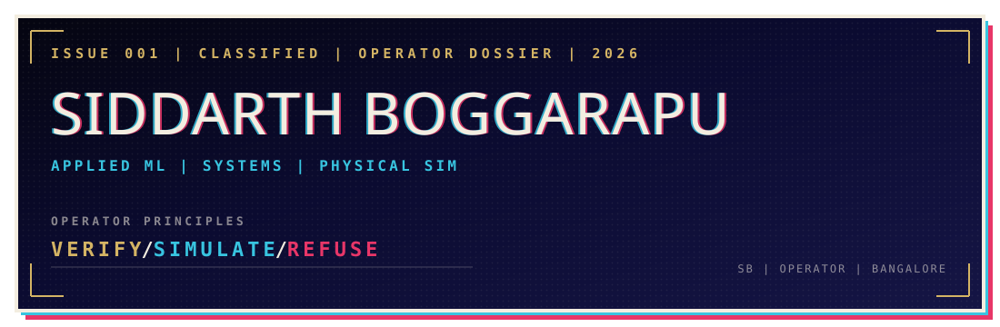

  

# Siddarth Boggarapu

Builder · Bangalore, India  
[Portfolio](https://siddarthb07.github.io/siddarthb/) · [Email](mailto:siddarthb078@gmail.com) · [LinkedIn](https://www.linkedin.com/in/siddarth-boggarapu-12411339b/) · [GitHub](https://github.com/Siddarthb07)

I build systems that operate under uncertainty. The question behind all of them: how do you know when a system is right, when it is wrong, and when it should refuse to act?

Operating principles: **verify** (look inside, not only at outputs), **simulate** (stress failure modes before reality costs), **refuse** (calibrated abstention when evidence is weak).

Domains I ship in: **LLM interpretability & uncertainty**, **multi-host threat hunting & campaign correlation**, **quantitative trading research**, **clinical risk scoring**, and **drone simulation / scientific ML**.

## Featured projects

### [Anima](https://github.com/Siddarthb07/Anima) — LLM interpretability & uncertainty probes
Open-source instrumentation for Hugging Face causal LMs. Forward hooks + probe heads read **valence**, **arousal**, and **uncertainty** from hidden states per token, with a guard that can recommend abstaining. FastAPI / WebSocket streaming + dashboard. [HF Spaces demo](https://huggingface.co/spaces/sidb078/Anima). Benchmarked on five open models; TinyLlama 1.1B scored 94/100 on the project's weighted validity rubric (60 = publication bar), [report](https://github.com/Siddarthb07/Anima/blob/main/docs/BENCHMARK_REPORT.md).  
Keywords: LLM interpretability, emotion probing, Hugging Face, PyTorch, FastAPI.

### [Corvex](https://github.com/Siddarthb07/corvex) — multi-host campaign correlator
Research correlator that fuses weak per-host detectors (lateral auth, micro-exfil, recon fanout) into ATT&CK-shaped attack timelines via HMAC-signed event envelopes. No LLM, no cloud API. **Standing claim:** holds up on sealed synthetic fleets; **not** validated on real enterprise telemetry or pure-benign baselines yet. Observe-only Windows / macOS sensors; live containment gated / dry-run.  
Keywords: threat hunting, MITRE ATT&CK, lateral movement, SIEM-style correlation, cybersecurity, Python.

### [GeoQuant](https://github.com/Siddarthb07/GeoQuant) — quantitative trading research platform
FastAPI + PyTorch research stack for ML daily/intraday signals, news sentiment, walk-forward backtesting with costs in the loop, and Alpaca paper-trade routing. The published walk-forward results keep the failed v1 (Sharpe −0.47) next to v2 (Sharpe 1.36, 2022 to 2025 test window); backtests only, not live returns.  
Keywords: algorithmic trading, quantitative finance, backtesting, sentiment analysis, Alpaca.

### [Drift](https://github.com/Siddarthb07/Drift) — clinical risk + health tracking
Flask health platform whose runtime path uses published **ACC/AHA Pooled Cohort** and **FINDRISC** models (not invented scores), plus a 17-biomarker timeline, wearables OAuth, and hard gates when data is incomplete.  
Keywords: clinical risk, health tracker, biomarkers, explainable ML, Flask.

### Aerospace / scientific ML
Self-driven simulators (reduced-order, not CFD) that informed the drones I build and fly, plus a **10-day** IISc vortex-ring internship (May 2025) where I built vortex-tracker. The other repos are personal work, before and after IISc:

| Repo | What it is |
| --- | --- |
| [Drone-Vortex-Ring-Simulation](https://github.com/Siddarthb07/Drone-Vortex-Ring-Simulation) | Reduced-order vortex rings — Kelvin Γ, Helmholtz self-induction, viscous decay |
| [Propeller-simulator](https://github.com/Siddarthb07/Propeller-simulator) | BEMT-style propeller model, simplified; full BEMT scaffolded (GUI + CLI + CSV sweeps) |
| [vortex-tracker](https://github.com/Siddarthb07/vortex-tracker) | OpenCV ring diameter / propagation speed from high-speed imagery |
| [NeuralVortex](https://github.com/Siddarthb07/NeuralVortex) | Early ML surrogate (TFNO / Conv3D path) on fields from my reduced-order simulator; smoke-scale, no accuracy results yet |

Keywords: vortex ring, drone aerodynamics, fluid dynamics, reduced-order modeling, Fourier Neural Operator, BEMT.

### Also public
[text2sql-rag](https://github.com/Siddarthb07/text2sql-rag) (clean-room Spider text-to-SQL RAG pipeline; evaluation pending) · [VidhiSethu](https://github.com/Siddarthb07/VidhiSethu) (Indian-legal RAG architecture docs) · [homelab-rpi](https://github.com/Siddarthb07/homelab-rpi) · [cursor-llm-council](https://github.com/Siddarthb07/cursor-llm-council)

## Experience

**Summer Intern — Indian Institute of Science (IISc), Bangalore** · May 2025 · **10 days**  
Vortex-ring internship; built [vortex-tracker](https://github.com/Siddarthb07/vortex-tracker). The simulation portfolio is self-driven, not an IISc research fellowship.

**Engineering Intern — Vegam Solutions** · two roles, Q3 2025 and Q1 2026  
Air-filtration hardware prototype (Q3 2025); text-to-SQL RAG pipeline, 1 month full-time (Q1 2026, **NDA**). Public clean-room companion: [text2sql-rag](https://github.com/Siddarthb07/text2sql-rag) on the Spider benchmark (evaluation pending).

**Founder — [Athera](https://athera.digital)** · Ongoing  
AI automation, lead workflows, and websites for small businesses.

**Co-founder — ORQIS AI** · Ongoing  
Detect silent agent failures (e.g. tool-call loops), explain them, and open reviewable patches with a human in the loop.

## Stack

Python · TypeScript · PyTorch · Hugging Face · FastAPI · Next.js · Flask · Postgres · Qdrant · Redis · Docker · Linux · Raspberry Pi

## Outside code

Football (school team 4 years; Goa Globe 2024, team 2nd place) · competitive skating (past) · badminton · swimming · Model UN · two SWEA school trips (three days each) · 50+ hrs community service, including websites for NGOs.

---

[Open the full interactive dossier (live sims) →](https://siddarthb07.github.io/siddarthb/)
